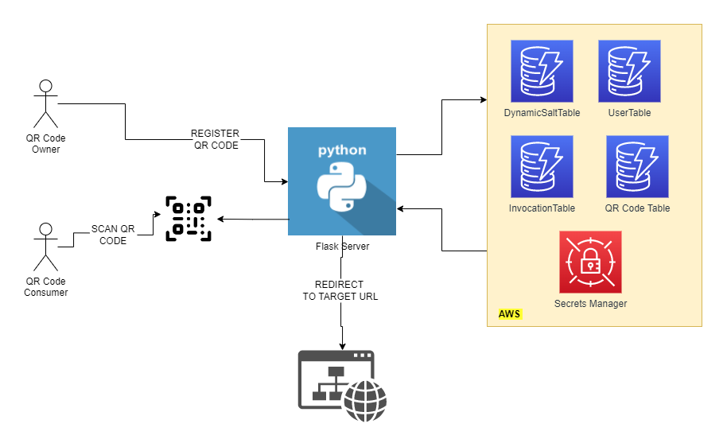
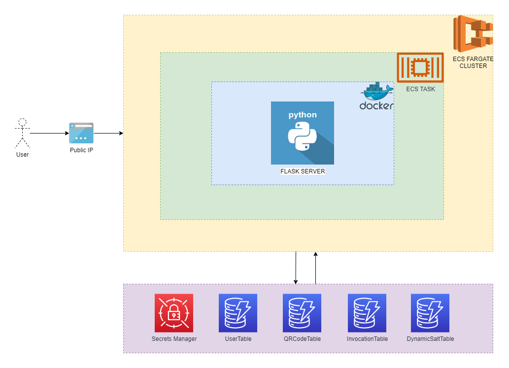

# QR Code Analytics Flask Application 📓

[](https://github.com/onerishabh/qrcode-analytics-flask/actions/workflows/aws-deploy.yml) [](https://www.gnu.org/licenses/gpl-3.0) [](https://makeapullrequest.com)

This is a flask app that lets user download QR Code for a given `targetURL`. This application helps user get analytics on when their QR Codes were scanned, device from which QR Code was scanned, location of scanning. Users can maintain as many QR Codes in the application as they want.

# Table of Contents 
1. [Application Demo](#application-demo)
2. [Application Overview](#application-overview)
3. [Application Backend Overview](#application-backend-overview)
4. [API Documentation](#api-documentation)
5. [GitHub Actions / CI CD Pipline](#github-actions--ci-cd-pipline)
6. [Infrastructure-as-Code](#infrastructure-as-code)
8. [Release History](#release-history)
7. [Future Plans/Improvements](#future-plansimprovements)

# Application Demo


# Application Overview



# Application Backend Overview



# API Documentation

## Add User
```
https://{public-ip-address}:5000/registerUser?name={name-of-user}&email={email-of-user}password={password-of-user}
```

## Authenticate User
```
https://{public-ip-address}:5000/authUser?email={email-of-user}&password={password-of-user}
```

## Create QR Code
```
https://{public-ip-address}:5000/qrcode/{url-to-be-qrcodeified}
```

Application generated QR Code points to `https://{public-ip-address}:5000/short/{qr-code-id}` which redirects to target 

# GitHub Actions / CI CD Pipline
This application can be deployed to production using just one click on `GitHub Actions`.
 
Make sure, `AWS_ACCESS_KEY` and `AWS_SECRET_KEY` are created/updated with valid credentials.

Go to Actions>> .github/workflows/aws-deploy.yml >> Run Workflow

# Infrastructure-as-Code
The entire application has two `AWS Cloudformation` stacks: `InfrastructureStack`, `QRCodeFlaskServerStack`. All three cloudformation stacks are deployed to `AWS` using [`AWS Cloud Development Kit`](https://aws.amazon.com/cdk/). 

This `cdk` application is a `Java` based. Make sure `node`, `aws-cdk`, `aws-cli`, `java`, `mvn` are installed on software release machine. 

# Release History
1. [v1.0.0](https://github.com/onerishabh/qrcode-analytics-flask/releases/tag/v1.0.0) - 8th August, 2022

source [repository](https://github.com/onerishabh/qrcode-analytics-flask/fork)
